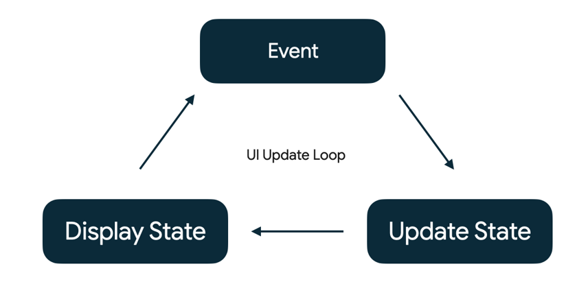

# Jet pack compose layouts
## CodeLad - 3 (State in compose)
https://developer.android.com/codelabs/jetpack-compose-state?continue=https%3A%2F%2Fdeveloper.android.com%2Fcourses%2Fpathways%2Fjetpack-compose-for-android-developers-1%23codelab-https%3A%2F%2Fdeveloper.android.com%2Fcodelabs%2Fjetpack-compose-state#1

## state 
An app's "state" is any value that can change over time. This is a very broad definition and encompasses everything from a Room database to a variable in a class.

**Key idea:** State determines what is shown in the UI at any particular time.

**Any action that causes the modification of state is called an "event"**

## Event
Events are inputs generated from outside or inside an application, such as:

- The user interacting with the UI by, for example, pressing a button.
- Other factors, such as sensors sending a new value, or network responses.

**While the state of the app offers a description of what to display in the UI, 
events are the mechanism through which the state changes, resulting in changes to the UI.**



## Memory in a composable function

- **The Composition:** a description of the UI built by Jetpack Compose when it executes composables.

- **Initial composition:** creation of a Composition by running composables the first time.

- **Recomposition:** re-running composables to update the Composition when data changes.

**Compose has a special state tracking system in place that schedules recompositions for any composables that read a particular state.**

Use Compose's **State** and **MutableState** types to make state observable by Compose.

```kotlin
 Column(modifier = modifier.padding(16.dp)) {
       // Changes to count are now tracked by Compose
       val count: MutableState<Int> = mutableStateOf(0)

       Text("You've had ${count.value} glasses.")
        Button(onClick = { count.value++ }, Modifier.padding(top = 8.dp)) {
           Text("Add one")
       }
   }
```

even this not work because
Scheduling recompositions is working fine. However, when a recomposition happens, the variable count is re-initialized back to 0, so we need a way to preserve this value across recompositions.

## Remember

the remember composable inline function. A value calculated by remember is stored in the Composition during the initial composition, and the stored value is kept across recompositions.

**You can think of using remember as a mechanism to store a single object in the Composition, in the same way a private val property does in an object.**

```kotlin
val count: MutableState<Int> = remember{ mutableStateOf(0) }

//use delegates like 'by' remove .value usage
var count by remember { mutableStateOf(0) }
```