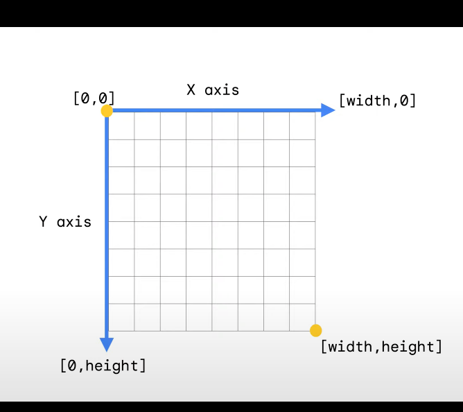
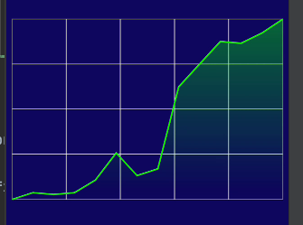

# Jet pack compose layouts
## Animation and Drawing in compose 

link:-  https://www.youtube.com/watch?v=1yiuxWK74vI&ab_channel=AndroidDevelopers


## Drawing:-

```kotlin
  Spacer(modifier = Modifier.fillMaxSize().drawBehind {
                drawCircle(color = Color.Green)
            })
```
drawing is done using coordinate system 


image refers to mobile screen

```kotlin
 Spacer(modifier = Modifier.fillMaxSize().drawBehind {
                drawCircle(color = Color.Green, center = Offset(
                    10.dp.toPx(),
                    100.dp.toPx()
                ),
                    radius = 60.dp.toPx()
                )
            })
```

## DrawScope Transformation

to get draw scope we can use Canvas compose which is similar to drawBehind modifier 
Canvas(modifier){
//we are in draw scope
}
### type of transformation
- insert
- scale
- rotate
- translate
- multiple transformation

```kotlin
Canvas(modifier = Modifier.fillMaxSize()){
                scale(scaleX = 10f, scaleY = 15f){
                    drawCircle(color = Color.Green, radius = 10.dp.toPx())
                }
            }
```



```kotlin
 Canvas(
                modifier = Modifier
                    .padding(8.dp)
                    .aspectRatio(3 / 2f)
                    .fillMaxSize()
            ) {
                val barWidthPx = 1.dp.toPx()
                drawRect(
                    Color.Gray, style = Stroke(barWidthPx)
                )
                val verticalLines = 4
                val verticalLinePx = size.width / (verticalLines + 1)
                repeat(verticalLines) { i ->
                    val startX = verticalLinePx * (i + 1)
                    drawLine(
                        Color.White,
                        Offset(startX, 0f),
                        Offset(startX, size.height),
                        strokeWidth = barWidthPx
                    )
                }
                val horizontalLines = 3
                val sectionSize = size.height / (horizontalLines + 1)
                repeat(horizontalLines) { i ->
                    val startY = sectionSize * (i + 1)
                    drawLine(
                        Color.White,
                        Offset(0f, startY),
                        end = Offset(size.width,startY),
                        strokeWidth = barWidthPx
                    )
                }
                val path =Constant.generatePath(graphData,size)
                val filledPath =Path()
                filledPath.addPath(path)
                filledPath.lineTo(size.width,size.height)
                filledPath.lineTo(0f,size.height)
                filledPath.close()

                val brush = Brush.verticalGradient(listOf(
                    Color.Green.copy(alpha = 0.6f),
                    Color.Transparent
                ))
                drawPath(
                    path = filledPath,
                    brush =brush
                )
                drawPath(path, color = Color.Green, style = Stroke(2.dp.toPx()))

            }
```

 